# Credit_Risk_Analysis

## Overview of the loan prediction risk analysis
LendingClub is a peer-to-peer lending services company. This analysis is taking a credit card dataset to test a variety of machine learning models to understand if there's a model that could support predicting credit risk and ultimately protect the lending company.

### Purpose of the analysis
The purpose of this analysis is to determine if we can provide a recommendation to LendingClub for a machine learning model to predict credit risk.

## Results
### Deliverable 1. 
We start by evaluating three resampling models to deterine which is better at predicting credit risk. For each model, we resample the dataset, train a logistic regression classifire, calculate an accuracy score, and generate both a confusion matrix and a classification report.

The original dataset includes 68,470 customers that are categorized as low risk compared to the 347 customers categorized as high risk. 

-- 1. RandomOverSampler. This model randomly oversamples and increases the number of customers categorized as high risk to balance the ratio of low to high risk.
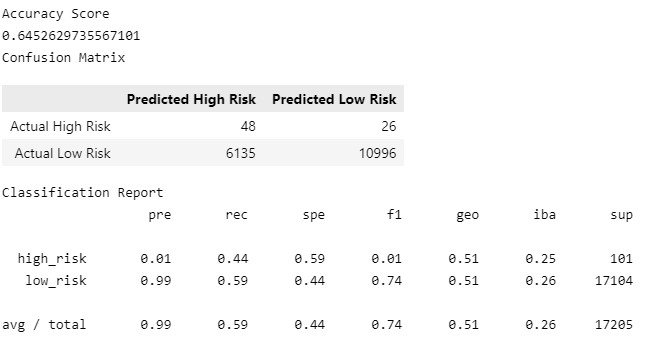

-- 2. SMOTE. Oversampling model.
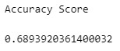
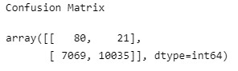
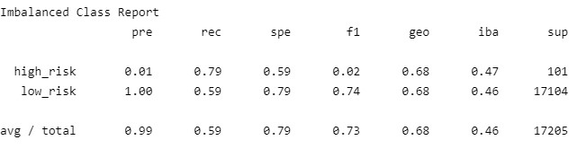

-- 3. ClusterCentroids to undersample
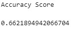
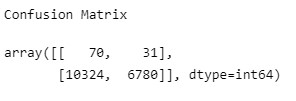
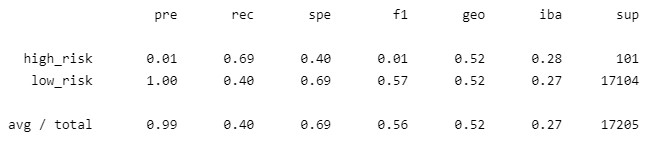

### Deliverable 2. 
Next, we use the SMOTEENN algorithm to predict credit risk to over- and undersample the dataset to see if it better predicts credit risk compared to the resampling algorithms. 

- Accuracy Score
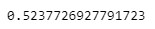

- Confusion Matrix
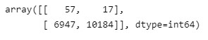

- Classification Report
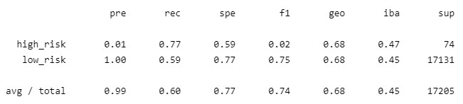

### Deliverable 3.
For this exercise, we will train and compare two difference ensemble classifiers to predict credit risk. 

-- Random Forest Classifier

Accuracy Score
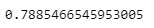

Confusion Matrix
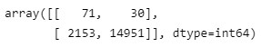

Imbalanced Class Report
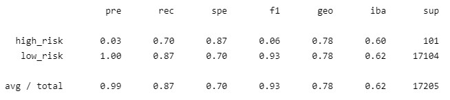

Features in Descending Order of Importance
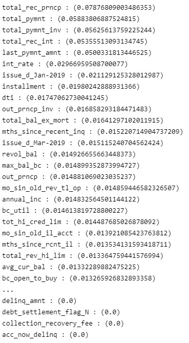

-- Easy Ensemble Classifier

Accuracy Score
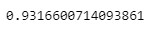

Confusion Matrix
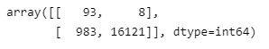

Imbalanced Class Report
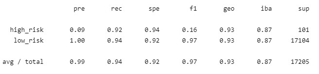

## Summary
For this analysis, we would like to identify the best model for detecting whether a customer is high or low risk for a loan. Looking at accuracy scores, the resamples models faired worse in comparison to the ensemble models. 

Random oversampling (0.65), SMOTE (0.69), and undersampling (0.66) were comparable in terms of accuracy. Smoteen was far worse with an accuracy score of 0.53.

Precision for all four models is 0.01 for high risk loand and 1.00 for low risk loans. This low precision score for high risk loans is due to the high number of false positives (too many of low risk loans were marked as high risk loans). 

The final two ensemble models scored better with accuracy scores of 0.79 and 0.93 for Balanced Random Forest Classifier and Easy Ensemble AdaBoost Classifier models,  respectively. We still see a high number of false positives (many low risk loans marked as high risk) as indicated by the precision number (0.03 for Random Forest and 0.09 for Easy Ensemble)Precision for high risk loans in both models weren’t high.

Fiven the accuracy data, it seems reasonable to move forward with further testing on an ensemble model. I would be cautious with the Easy Ensemble model as it's accuracy score is so much higher than the others that it may be overfit. 

I would consider fine-tuning/pruning the Random Forest further and continuing to evaluate the Easy Ensemble with another dataset before finalizing on a specific Ensemble model. 
